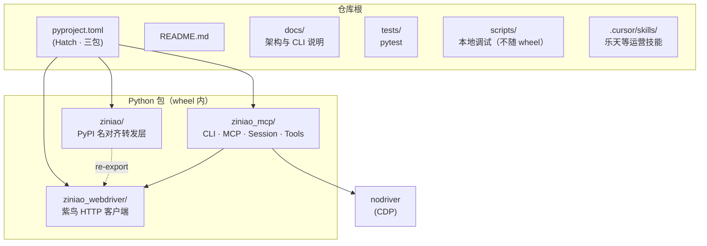

# ziniao — AI 上下文索引（根文档）

*
## 愿景与定位

**紫鸟与 Chrome 浏览器 AI 自动化**：让 Cursor / Claude 等 Agent 通过 **MCP** 与 **CLI** 统一操控紫鸟多店会话与本地 Chrome（CDP），覆盖导航、输入、截图、网络抓取、站点预设、录制回放等能力。PyPI 发行名为 [`ziniao`](https://pypi.org/project/ziniao/)，控制台入口为 `ziniao`（兼容 `ziniao-mcp` → `python -m ziniao_mcp`）。

## 架构总览（高层）

- **配置**：环境变量 → CLI 参数 → `~/.ziniao/.env` / `config.yaml`（与 README 表格一致）；MCP 子进程与终端 daemon 的 env 语义见 README。
- **运行时**：Typer CLI（`ziniao_mcp.cli`）经 **后台 daemon** 与 `SessionManager` 通信；`ziniao_mcp.server` 注册 FastMCP 工具，逻辑复用会话与工具层。
- **紫鸟侧**：`ziniao_webdriver.ZiniaoClient` 与桌面客户端 HTTP 交互；店铺打开后通过 CDP（`nodriver`）驱动浏览器。
- **站点扩展**：`ziniao_mcp.sites`（含乐天等 preset / `page_fetch` 协作）。

## 仓库结构（Mermaid）

## 模块索引（本地 `CLAUDE.md`）

| 路径 | 说明 |
|------|------|
| [ziniao/CLAUDE.md](ziniao/CLAUDE.md) | 与发行名一致的薄包，`import ziniao` 转发 `ziniao_webdriver` |
| [ziniao_mcp/CLAUDE.md](ziniao_mcp/CLAUDE.md) | CLI、MCP、daemon、`SessionManager`、tools、core、sites、stealth、recording |
| [ziniao_webdriver/CLAUDE.md](ziniao_webdriver/CLAUDE.md) | 紫鸟客户端 HTTP、端口探测、店铺 CDP 生命周期辅助 |
| [tests/CLAUDE.md](tests/CLAUDE.md) | pytest 布局、集成测试与契约测试入口 |
| [scripts/CLAUDE.md](scripts/CLAUDE.md) | 开发调试脚本（MCP 代理、spawn 测试等） |
| [docs/CLAUDE.md](docs/CLAUDE.md) | 给人看的架构、安装、CLI JSON、录制、stealth 等文档地图 |

## 全局规范（给 Agent / 贡献者）

- **目录规范**：物理目录用途、wheel 边界与 `exports/` 等落盘约定见 [docs/directory-conventions.md](docs/directory-conventions.md)。
- **Python**：`>=3.10`；风格与静态检查以 **Ruff** 为主、Pylint 为辅（见 `pyproject.toml` `[tool.ruff]` / `[tool.pylint]`）。
- **测试**：`uv run pytest`；异步用 `pytest-asyncio`。
- **不改业务代码边界**：`/init-project` 仅维护文档索引；功能改动需单独 PR。
- **依赖关键包**：`mcp`、`nodriver`、`typer`、`rich`、`httpx`、`requests`、`PyYAML`；Windows 时区场景依赖 `tzdata`（乐天日界等）。

## 覆盖率与增量续扫（本次）

| 指标 | 值 |
|------|-----|
| Git 跟踪文件数（近似总规模） | **174** |
| 本次定点深读 | **约 25** 个关键文件（入口、`pyproject`、架构文档、核心 dispatch/server 片段等） |
| 模块 `CLAUDE.md` 覆盖 | **6 / 6**（上表所列均有独立文档） |

**缺口**：`ziniao_mcp/cli/dispatch.py` 内联命令表体量大，未逐行通读；`recording/` 全链路 emit 变体、各 `sites/*` 子站实现细节建议按需打开。  
**建议下一步深挖**：`ziniao_mcp/recording/`、`ziniao_mcp/sites/rakuten/`、`ziniao_mcp/stealth/`、以及 `tests/integration_test.py` 与真实客户端联调相关路径。

