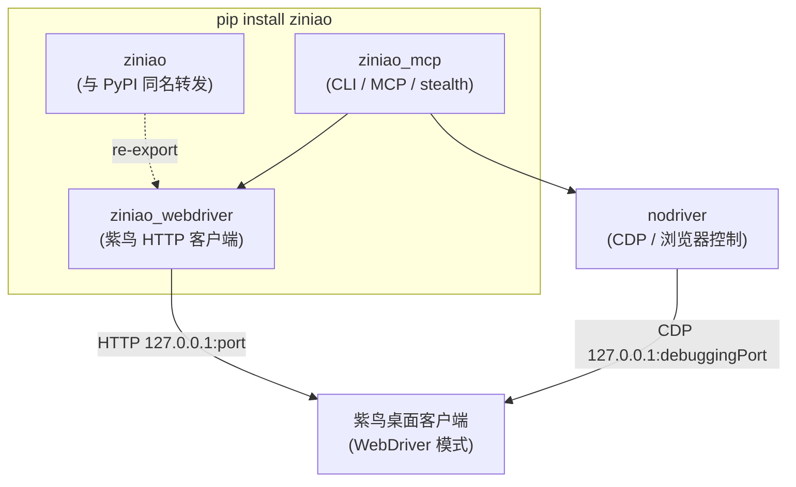

# 包与模块架构

## 发行物与 Python 包

PyPI 上只有 **一个** 发行物 `ziniao`，wheel 内包含 **三个** Python 顶层包（其中 `ziniao` 为与发行名对齐的薄转发层）：

| PyPI 名 | Python 导入名 | 职责 |
|---------|--------------|------|
| `ziniao` | `ziniao` | **推荐 RPA/脚本**：`from ziniao import ZiniaoClient, ensure_http_ready, open_store_cdp_port`（实现来自 `ziniao_webdriver`） |
| `ziniao` | `ziniao_mcp` | CLI（`ziniao` 命令）、MCP 服务、守护进程、SessionManager、stealth 模块、工具注册 |
| — | `ziniao_webdriver` | 与紫鸟桌面客户端的 HTTP 通信（heartbeat、startBrowser、getBrowserList…）+ 端口检测；与 `import ziniao` 等价符号，旧代码可不改 |

`ziniao_mcp` 依赖 `ziniao_webdriver`（而非反过来）；`nodriver` 作为 **`ziniao` 的声明依赖** 被传递安装。

## 三种使用场景

| 场景 | 需要什么 | 涉及的模块 |
|------|----------|------------|
| **Phase 1 CLI 调研**（`ziniao open-store`、`ziniao snapshot` 等） | `pip install ziniao` + 紫鸟客户端 | `ziniao_mcp.cli` → `SessionManager` → `ZiniaoClient` → nodriver |
| **MCP 服务**（`ziniao serve`） | 同上 | `ziniao_mcp.server` → 同上 |
| **Phase 3 独立脚本** | `pip install ziniao` + 紫鸟客户端（不需运行 CLI/MCP） | `from ziniao import ZiniaoClient`（或 `ziniao_webdriver`）+ nodriver |

独立脚本 **不需要克隆本仓库**，也不需要 CLI 守护进程；`pip install ziniao` 后任选 `import ziniao` 或 `import ziniao_webdriver` 均可。

## 安装策略

**当前推荐**：所有场景统一 `pip install ziniao`（或 `uv tool install ziniao`）。虽然独立脚本只用到 `ziniao_webdriver` + `nodriver`，但现阶段不提供「瘦包」——拆包会增加维护与版本对齐成本，收益有限。

**中长期**：若 RPA 安装体量敏感，可考虑发布独立 `ziniao-webdriver` 小包（仅依赖 `requests`），`ziniao` 全量包依赖它；跟踪项，视需求推进。

## stealth 与反检测

JS 补丁的规范实现在 `ziniao_webdriver/js_patches.py`（`build_stealth_js()`、`STEALTH_JS`、`STEALTH_JS_MINIMAL` 等），`ziniao_mcp/stealth/js_patches.py` 作为 re-export shim 保持向后兼容。`ziniao_mcp/stealth/__init__.py` 中的 `apply_stealth()` 在 `SessionManager.open_store` 后通过 CDP 注入。

独立脚本若不经过 `SessionManager`，可通过 `ZiniaoClient.open_store(..., js_info=...)` 传入 `STEALTH_JS_MINIMAL`（客户端侧注入），或自行调 `build_stealth_js()` + nodriver 的 `Page.addScriptToEvaluateOnNewDocument`。

详见本仓库 `skills/store-rpa-scripting/references/anti-automation.md`。
