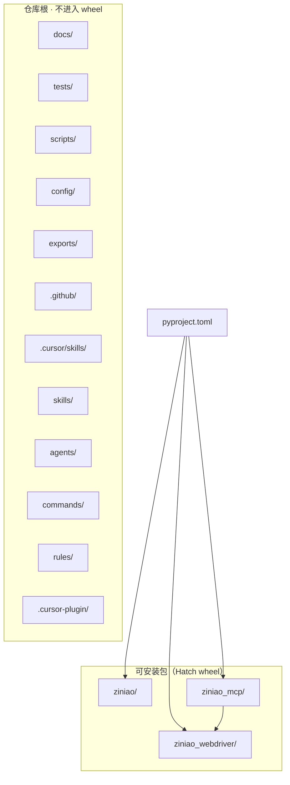

# 仓库目录规范

本文约定 **物理目录用途、分层关系、子目录清单与落盘习惯**；与根 [`CLAUDE.md`](../CLAUDE.md) 的愿景与模块索引互补。各包 API 细节仍以子目录 `CLAUDE.md` 与 `docs/` 内专题文档为准。

---

## 1. 分层总览（源码与仓库资产）

下列为**有意维护的目录**（不含虚拟环境、缓存、本地 Chrome 配置等；见 §6）。



---

## 2. 仓库根目录（逐项说明）

| 路径 | 分层角色 | 说明 |
|------|-----------|------|
| `ziniao/` | 发行包 | PyPI 名对齐**薄包**，仅转发/暴露 `ziniao_webdriver`，不承载业务编排。 |
| `ziniao_mcp/` | 发行包 | CLI、MCP、`SessionManager`、tools、core、`sites`、`stealth`、`recording` 等主逻辑。 |
| `ziniao_webdriver/` | 发行包 | 紫鸟 HTTP 客户端、CDP/标签页辅助、与浏览器相关的 JS patch 等。 |
| `docs/` | 文档 | 给人读的架构、安装、CLI JSON、录制、stealth、站点抓取等；**规范类文档**（含本文）放此处。 |
| `tests/` | 质量 | `pytest` 用例、`conftest.py`、集成入口等；详见 [`tests/CLAUDE.md`](../tests/CLAUDE.md)。 |
| `scripts/` | 开发 | 本地调试、冒烟脚本等，**不随 wheel**；详见 [`scripts/CLAUDE.md`](../scripts/CLAUDE.md)。 |
| `config/` | 配置模板 | 示例与模板（如 `config.yaml.example`）；含密钥的 `config.yaml` 见根 `.gitignore`，勿提交。 |
| `exports/` | 数据落盘（推荐） | 运营/分析导出（JSON、CSV 等）；建议 `exports/<店铺或场景标识>/`。是否入库由团队决定，**勿提交密钥或 PII**。 |
| `.github/workflows/` | CI | GitHub Actions（测试、发布等）。 |
| `.cursor/skills/` | Cursor 技能 | **本仓库**维护的技能、脚本与 `references/`；业务代码**不得**依赖该路径。 |
| `skills/` | 技能副本/模板 | 顶层技能目录；根 `pyproject.toml` 中 Ruff `extend-exclude` 含 `skills`，**默认不参与 Ruff 全仓扫描**。与 `.cursor/skills/` 并存时注意职责：以仓库协作为准优先维护 `.cursor/skills/`。 |
| `agents/` | Agent 说明 | 面向 Agent 的操作说明类 Markdown（如 `ziniao-operator.md`），非运行时模块。 |
| `commands/` | 命令说明 | 给人看的命令/流程文档（如 `quick-check-stores.md`），非 Typer 实现。 |
| `rules/` | 规则说明 | 编辑器/Agent 规则类文档资产。 |
| `.cursor-plugin/` | 插件元数据 | Cursor 插件配置（`plugin.json` 等）。 |

**根目录常见单文件（节选）**：`pyproject.toml`、`README.md`、`LICENSE`、`.env.example`、`.mcp.json`、`preset.json` 等；入口与表格以 README / `docs/cli-json.md` 为准。

**构建产物**：`dist/` 由构建生成，已在 `.gitignore` 中忽略，**不作为源码分层的一部分**维护。

---

## 3. `ziniao_mcp/` 内部分层与子目录

### 3.1 目录树（逻辑结构）

```text
ziniao_mcp/
├── __init__.py
├── __main__.py              # python -m ziniao_mcp
├── server.py                # FastMCP 入口
├── session.py               # SessionManager
├── recording_context.py
├── dotenv_loader.py
├── iframe.py
├── _interaction_helpers.py
├── cli/
│   ├── __init__.py          # Typer app、全局 flag
│   ├── __main__.py
│   ├── daemon.py            # 后台常驻与 JSON 请求
│   ├── dispatch.py          # 命令名 → 实现（大文件）
│   ├── output.py
│   ├── connection.py
│   ├── help_epilog.py
│   └── commands/            # 按域拆分的子命令实现
│       ├── navigate.py
│       ├── store.py
│       ├── chrome.py
│       ├── session.py
│       ├── network_cmd.py
│       ├── site_cmd.py
│       ├── recorder.py
│       ├── lifecycle.py
│       ├── batch.py
│       ├── config_cmd.py
│       ├── check.py
│       ├── get.py
│       ├── find.py
│       ├── scroll.py
│       ├── mouse.py
│       ├── interact.py
│       ├── info.py
│       ├── update_cmd.py
│       └── __init__.py
├── tools/                   # MCP/CLI 可调用的工具层
│   ├── chrome.py
│   ├── store.py
│   ├── navigation.py
│   ├── input.py
│   ├── network.py
│   ├── session_mgr.py
│   ├── recorder.py
│   ├── debug.py
│   ├── emulation.py
│   ├── _keys.py
│   └── __init__.py
├── core/                    # 页面级底层能力
│   ├── find.py
│   ├── scroll.py
│   ├── check.py
│   ├── get_info.py
│   ├── network.py
│   └── __init__.py
├── sites/                   # 站点预设、分页、page_fetch 规整
│   ├── _base.py
│   ├── __init__.py
│   └── rakuten/             # 乐天：Python + 大量 *.json preset
│       ├── __init__.py
│       └── *.json / ref.md  # 预设与维护说明
├── stealth/                 # open_store 后 CDP 注入等
│   ├── __init__.py
│   ├── human_behavior.py
│   └── js_patches.py
├── recording/               # 录制 IR、缓冲、emit
│   ├── ir.py
│   ├── buffer.py
│   ├── locator.py
│   ├── capture_dom2.py
│   ├── emit_nodriver.py
│   ├── emit_playwright.py
│   └── __init__.py
└── CLAUDE.md
```

### 3.2 依赖关系约定（简）

| 层级 | 典型内容 | 依赖方向 |
|------|-----------|-----------|
| `cli/commands/` | 用户命令、参数解析 | → `cli/dispatch` / `session` / `tools` |
| `tools/` | 编排与对外工具契约 | → `core`、`ziniao_webdriver`、`sites`、`recording`、`stealth` |
| `core/` | DOM/滚动/网络辅助 | → `nodriver` / 浏览器抽象，避免直接写 CLI |
| `sites/<平台>/` | 平台差异与 preset | 先读 `sites/_base.py` 再扩展子包 |
| `stealth/`、`recording/` | 横切能力 | 由 `tools`/`session` 侧按需调用 |

新增 **Typer 子命令** 时：在 `cli/commands/` 增加模块，并同步维护 `cli/dispatch.py` 与 `cli/commands/__init__.py` 中的注册链（详见 [`ziniao_mcp/CLAUDE.md`](../ziniao_mcp/CLAUDE.md)）。

---

## 4. `ziniao_webdriver/` 与 `ziniao/`

### 4.1 `ziniao_webdriver/`

| 文件 | 说明 |
|------|------|
| `client.py` | 紫鸟桌面客户端 HTTP 交互 |
| `lifecycle.py` | 店铺与 CDP 生命周期辅助 |
| `cdp_tabs.py` | 标签页 / CDP 相关辅助 |
| `js_patches.py` | 与浏览器上下文相关的 JS 片段 |
| `__init__.py` | 包导出 |

### 4.2 `ziniao/`

| 文件 | 说明 |
|------|------|
| `__init__.py` | 转发到 `ziniao_webdriver`，保持 `import ziniao` 与发行名一致 |
| `CLAUDE.md` | 薄包说明 |

---

## 5. `tests/`、`scripts/`、`docs/`

- **`tests/`**：以 `test_*.py` 为主；`integration_test.py` 等契约/端到端风格用例见 [`tests/CLAUDE.md`](../tests/CLAUDE.md)。
- **`scripts/`**：一次性调试、冒烟、批处理；不 import 为生产 API 的唯一来源。
- **`docs/`**：文档地图见 [`docs/CLAUDE.md`](CLAUDE.md)；架构类变更请与根 `CLAUDE.md` 模块表对齐，避免长期漂移。

---

## 6. 本地生成物与不应纳入「分层规范」的路径

以下目录常出现在工作区，但属于**环境或缓存**，不在包分层内约定职责；提交前留意 `.gitignore`。

| 路径 | 说明 |
|------|------|

| `.pytest_cache/`、`.ruff_cache/` | 工具缓存 |
| `out/` | 本地抓取/预设响应等导出（**已在 `.gitignore`**） |
| `dist/`、`build/` | 构建输出 |

与 `out/` 区分：**`exports/`** 为建议的、可团队约定的「可分享分析结果」落点；`out/` 更偏临时与可能含 token 的捕获物。

---

## 7. 命名与协作习惯（重申）

- 目录名：**小写 + 下划线**；平台子包可用短名（如 `rakuten`）。
- 不在 `tests/`、`scripts/` 下维护与三包平行的「影子业务包」。
- 大体积 JSON/CSV：**优先 `exports/` 或工作区外**；`ziniao_mcp/sites/` 下的 `*.json` 仅限**已契约化的站点 preset**，勿把一次性复盘大文件堆进源码树。

---

## 8. 与静态检查的关系

根 `pyproject.toml` 中 `[tool.ruff] extend-exclude` 包含 `skills`：顶层 `skills/` 内 Markdown 等**不走**仓库默认 Ruff Python 扫描。新增顶层目录若需纳入检查，应同步调整 `extend-exclude` 与 CI 预期。
