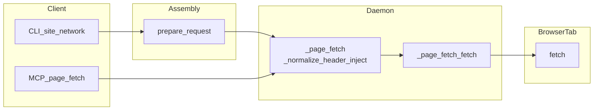

# 页面内请求与站点模板（Site presets）

在当前浏览器**活动标签页**的 JavaScript 环境里执行请求，自动带上该页的 **Cookie**；可按模板声明式注入**鉴权头**（`header_inject`）、**变量**、**分页**。适用于已登录后台的 XHR/API 拉数，而不是无头爬公网。

## 架构

```text
┌─────────────────────────────────────────────────────────────────┐
│ 入口                                                            │
│  CLI: ziniao <site> <action> / network fetch -p / -f / URL      │
│  MCP: page_fetch                                                │
│  fetch-save: 抓包 → JSON 模板                                    │
└────────────────────────┬────────────────────────────────────────┘
                         ▼
┌─────────────────────────────────────────────────────────────────┐
│ 合并：prepare_request()                                          │
│  加载预设/文件 → 渲染 {{vars}} → 合并 CLI 覆盖                     │
│  → plugin.before_fetch()                                        │
│  输出 spec（header_inject 校验尚未执行，见下一步）                     │
└────────────────────────┬────────────────────────────────────────┘
                         ▼
┌─────────────────────────────────────────────────────────────────┐
│ daemon：_page_fetch()                                            │
│  _normalize_header_inject(args) — CLI 与 MCP 唯一归一化点           │
│  → navigate_url（若配置）→ fetch 或 js 模式                       │
└────────────────────────┬────────────────────────────────────────┘
                         ▼
┌─────────────────────────────────────────────────────────────────┐
│ _page_fetch_fetch()                                              │
│  按已归一化 spec 生成 JS：                                        │
│    header_inject[] → 按 source 读值 → h[name] = token           │
│    fetch(url, {headers, body, credentials:'include'})           │
└────────────────────────┬────────────────────────────────────────┘
                         ▼
┌─────────────────────────────────────────────────────────────────┐
│ 浏览器活动标签页                                                  │
│  document.cookie  →  同源 fetch  →  HTTP 响应                    │
└─────────────────────────────────────────────────────────────────┘
```

设计原则：**`header_inject` 校验只在 `_page_fetch` 做一次**；`prepare_request` 只做合并与插件钩子。**特例**用 `mode: "js"` 或 `SitePlugin.before_fetch` 表达，不在 `_page_fetch_fetch` 里堆分支。

### 架构考量（分层、边界、取舍）

**1. 三层职责**

| 层 | 代码锚点 | 做什么 | 不做什么 |
|----|----------|--------|----------|
| **装配** | `prepare_request` | 读预设/文件、渲染 `{{vars}}`、合并 CLI、跑 `before_fetch` | 不做 `header_inject` 校验 |
| **执行入口** | `dispatch._page_fetch` | 导航、`_normalize_header_inject`、按 `mode` 分支 | 不含具体站点 if/else |
| **传输实现** | `_page_fetch_fetch` | 把 dict 编成页面内 `fetch` + `credentials: 'include'` | 不再改注入语义 |

**2. 为何 `header_inject` 校验放在 daemon 的 `_page_fetch`**

- **入口收敛**：CLI（经 `prepare_request`）与 **MCP（直传 args）** 最终都进入同一函数；校验只做一次，避免装配层与执行层重复。
- **边界清晰**：装配产物可以视为**意图**（用户/预设写了什么）；进入 `_page_fetch` 之后才是**即将执行的 HTTP 契约**。
- **插件顺序**：`before_fetch` 仍可改写 `header_inject`；校验在**插件之后、真正发请求之前**。

**3. 接受的权衡**

- `prepare_request` 返回的 dict 中 `header_inject` 可能含无效项，直到 daemon 执行才被过滤。当前产品路径上唯一消费者是 `page_fetch`，无额外中间层依赖已校验的 spec；若将来有只读 spec 的工具，需自行调用 `_normalize_header_inject`。

**4. 独立管线与逃逸舱**

- **`fetch-save`**：从抓包**反向生成** JSON，不走 `prepare_request` / `_page_fetch`；表驱动识别 CSRF 头，与运行时管线正交。
- **`mode: "js"` / `SitePlugin`**：当声明式字段无法表达鉴权或签名时，在**装配层或页面内脚本**解决，而不是往 `_page_fetch_fetch` 塞分支。



## 会话鉴权（auth）

页面内请求复用浏览器的登录态，不做额外登录。`auth.type` 声明服务器**验证身份的方式**：

| `auth.type` | 含义 | 模板字段 |
|-------------|------|---------|
| `cookie` | 只带 Cookie（`credentials: 'include'`） | 无额外字段 |
| `xsrf` | Cookie + 从 Cookie 读反 CSRF 令牌写入请求头 | `header_inject` (source: cookie) |
| `token` | Bearer / 自定义令牌（通常从页面状态获取） | `header_inject` (source: localStorage/eval) 或 `mode: "js"` |
| `none` | 无需鉴权 | 无 |

`auth.type` 是**给人和工具看的标签**（`site list` 显示、Agent 决策参考）；实际行为由 `header_inject` / `mode` 等字段驱动。

`header_inject` 的字段说明、`fetch-save` 自动识别、扩展方式 → **[page-fetch-auth.md](page-fetch-auth.md)**。

## 最简用法

先让标签页处在目标站点（或模板里配置了 `navigate_url` 会自动跳转）。

```bash
# 列出内置/用户模板（含鉴权类型、是否支持分页）
ziniao site list

# 查看变量说明与示例
ziniao site show rakuten/rpp-search

# 一行调用
ziniao rakuten rpp-search -V start_date=2026-03-01 -V end_date=2026-03-07

# 分页
ziniao rakuten rpp-search -V start_date=... -V end_date=... --page 2
ziniao rakuten rpp-search -V start_date=... -V end_date=... --all -o out.json

# 非 JSON 体（例：RMS 评论 CSV，预设内已声明 CP932→UTF-8）
ziniao rakuten reviews-csv -o reviews.csv
# 日期：默认 last_days=30（日本时间自然日）；显式 -V start_date= / end_date= 时覆盖

# 禁用/启用模板
ziniao site disable rakuten/rpp-search
ziniao site enable rakuten/rpp-search
```

## 底层命令（调试用）

```bash
ziniao network fetch -p rakuten/rpp-search -V start_date=... -V end_date=... [--page N] [--all] [-o file]
ziniao network fetch -f ./my-request.json
ziniao network fetch https://api.example.com/x -X POST -d '{"q":1}'
ziniao network fetch --script 'axios.post("/api", __BODY__).then(r=>r.data)' -d '{"q":1}'
ziniao network fetch-save --filter "reports/search" -o tpl.json
```

`fetch-save`：从已捕获请求生成 JSON 模板（可先 `ziniao network list` 看 id）。

## 保存响应（`-o`）与编码

- 页面侧用 **`arrayBuffer()` → Base64** 回传 **`body_b64`**，避免在浏览器里先当「错误编码文本」解码导致 **`U+FFFD` / `ef bf bd`** 不可恢复。
- **`-o`**：默认写入与网络响应**一致的字节**；CLI 可用 **`--decode-encoding`**（如 `cp932`）先解码，再用 **`--output-encoding`** 控制落盘编码（未指定时多为 UTF-8 文本）。
- 预设根字段 **`output_decode_encoding`**：为 **`ziniao network fetch` / `ziniao <site> <action>`** 提供默认 `--decode-encoding`，CLI 仍可覆盖。

## JSON 模板字段

| 字段 | 作用 |
|------|------|
| `navigate_url` | 执行前若不在该页则先导航 |
| `mode` | `fetch`（默认）或 `js`（走页面内脚本，配合 `script`） |
| `auth` | `type`: `cookie` / `xsrf` / `token` / `none`；`hint` 给人看的说明 |
| `header_inject` | `list[dict]`：声明式 header 注入规则；详见 [page-fetch-auth.md](page-fetch-auth.md) |
| `vars` | 模板变量定义；正文里用 `{{name}}` |
| `pagination` | `body_field` 或 `offset`：支持 `--all` 自动翻页合并列表 |
| `output_decode_encoding` | 可选。`-o` 时默认 `--decode-encoding`（如日文 CSV 常用 `cp932`） |

## 从内置模板派生（自定义）

```bash
# 将内置模板复制到 ~/.ziniao/sites/ 供编辑（同名覆盖内置）
ziniao site fork rakuten/rpp-search

# 另存为新 ID
ziniao site fork rakuten/rpp-search mysite/rpp-custom
```

编辑后直接用 `-p` 调用——`load_preset` 会优先读用户目录。

也可手动将 `.json` 放到 `~/.ziniao/sites/<站点名>/`，会覆盖同名内置模板。

Python 插件（可选）：`~/.ziniao/sites/<站点>/__init__.py` 或包内 `ziniao_mcp/sites/<站点>/`，继承 `SitePlugin`，实现 `before_fetch` / `after_fetch` / `paginate`（复杂分页）。第三方包可通过 `ziniao.sites` entry point 注册。

## `ziniao eval` 与 Promise

```bash
ziniao eval --await "fetch('/api').then(r => r.text())"
```

`--await` 在主文档与 iframe 上下文中均会传给 CDP。

## MCP

工具 **`page_fetch`**：参数为 URL、method、body、headers（JSON 字符串）、`header_inject`（JSON 数组字符串）、`mode`、`script`、`navigate_url`，语义与 daemon 的 `page_fetch` 一致。成功时返回 JSON 含 **`body`**（可读字符串）与 **`body_b64`**（原始响应字节，Base64）。

## 另见

- **[page-fetch-auth.md](page-fetch-auth.md)** — Header 注入（`header_inject`）：使用、实现与扩展
- 完整命令表：[commands.md](commands.md)
